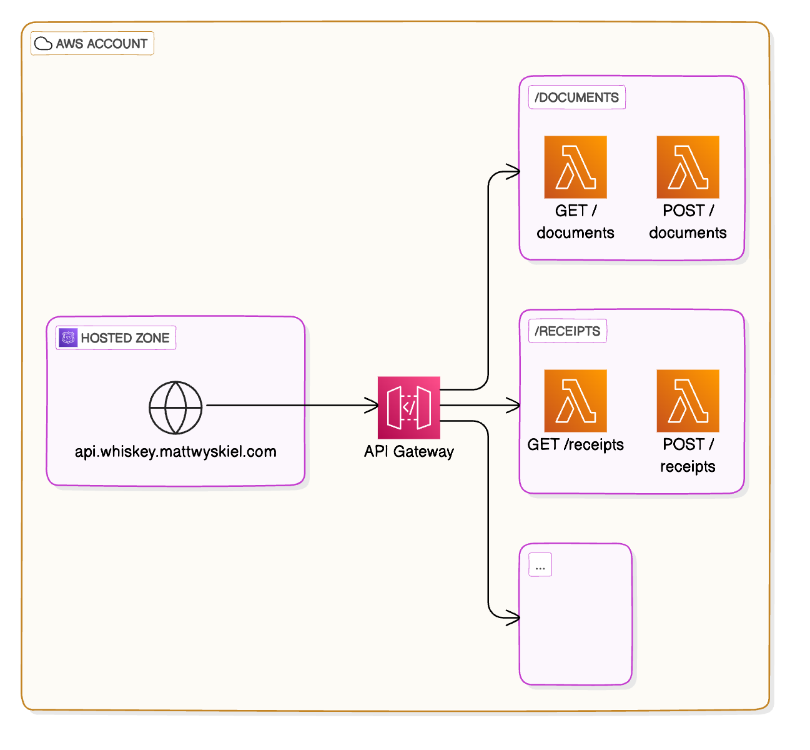

# Whiskey Platform API Core Infrastructure

While [Whiskey](https://github.com/whiskey-platform) is an event-based system, some functions require API calls to work well. This is especially the case when it comes to mobile app integrations.

This codebase hosts that core infrastructure.

## Stack

- **API Gateway:** [Amazon API Gateway](https://aws.amazon.com/api-gateway/)
- **Infrastructure-as-Code:** [SST v2](https://v2.sst.dev) (based on [AWS CDK](https://aws.amazon.com/cdk/))
