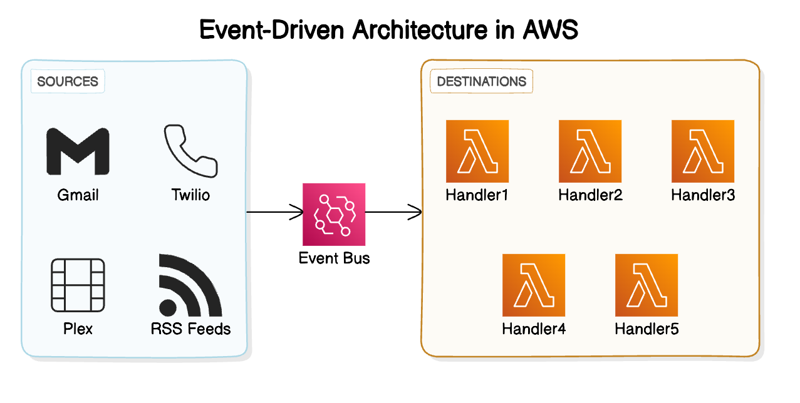

# Whiskey Platform Event Core Infrastructure

[Whiskey](https://github.com/whiskey-platform) is an event-based personal automation system. I decided to use Amazon EventBridge as a source of truth for all events to flow through.

## Stack

- **Event Sourcing:** [Amazon EventBridge](https://aws.amazon.com/eventbridge/)
- **Infrastructure-as-Code:** [SST v3](https://sst.dev) (based on [Pulumi](https://www.pulumi.com/))
